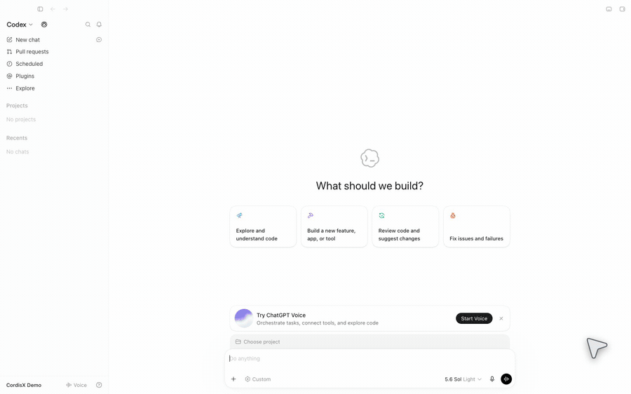

# CordisX Homepage

Source for the [CordisX homepage](https://cordisx.github.io/).

CordisX is an unofficial local extension host for Codex Desktop. This site
introduces the project and links to documentation owned by the product
repositories.

- [Find product documentation](https://cordisx.github.io/docs/)
- [Browse the CordisX Marketplace](https://cordisx.github.io/marketplace/)

## Maintenance entry points

The static site source lives at the repository root, with Marketplace pages
under `marketplace/`. Read the [maintenance rules](.agents/rules/README.md)
before making changes. The [maintenance index](.agents/docs/README.md) routes
design, Marketplace, and media work to their owning documents; checks are
defined in [`package.json`](package.json).

## Regenerate the real Codex showcase

The [showcase capture workflow](.agents/docs/showcase-capture.md) owns
prerequisites, commands, isolation, and verification for real Codex workspace
and CordisX Manager screenshots and recordings in English and Chinese,
light and dark themes.

## Record the AI-first plugin demo

The AI-first demo records a real Codex Agent editing an independent plugin,
the development watcher replacing its generation, and a native Send click
activating a Host-owned full-screen confetti effect. Read the dedicated
[capture workflow](.agents/docs/ai-plugin-demo-capture.md) for its exact
checkpoint, commands, privacy boundary, and evidence requirements.

<picture>
  <source media="(prefers-color-scheme: dark)" srcset="assets/motion/cordisx-ai-plugin-demo-en-dark.gif">
  <source media="(prefers-color-scheme: light)" srcset="assets/motion/cordisx-ai-plugin-demo-en-light.gif">
  
</picture>

English dark: [MP4](assets/motion/cordisx-ai-plugin-demo-en-dark.mp4) ·
[WebM](assets/motion/cordisx-ai-plugin-demo-en-dark.webm) ·
[GIF](assets/motion/cordisx-ai-plugin-demo-en-dark.gif) ·
[evidence](assets/motion/cordisx-ai-plugin-demo-en-dark.json) ·
[source](assets/motion/cordisx-ai-plugin-demo-en-dark.plugin.tsx)

English light: [MP4](assets/motion/cordisx-ai-plugin-demo-en-light.mp4) ·
[WebM](assets/motion/cordisx-ai-plugin-demo-en-light.webm) ·
[GIF](assets/motion/cordisx-ai-plugin-demo-en-light.gif) ·
[evidence](assets/motion/cordisx-ai-plugin-demo-en-light.json) ·
[source](assets/motion/cordisx-ai-plugin-demo-en-light.plugin.tsx)

Chinese: [dark MP4](assets/motion/cordisx-ai-plugin-demo-zh-dark.mp4) ·
[light MP4](assets/motion/cordisx-ai-plugin-demo-zh-light.mp4)

The workflow distinguishes two preliminary checks: `--dry-run` exercises the
workspace and encoders without reading authentication or launching Codex;
`--launch-smoke` reads the selected authentication into a disposable profile
and starts an isolated real renderer. Launch smoke sends no prompt and
publishes no media. Use the [runbook's instructions](.agents/docs/ai-plugin-demo-capture.md#dry-run)
for either check.
