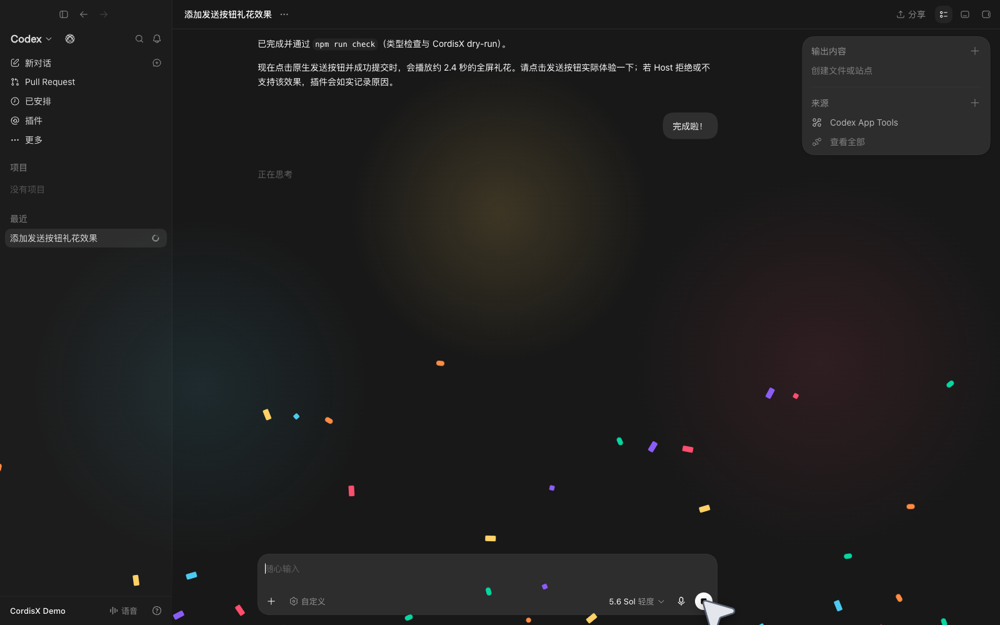

# CordisX Homepage

Homepage source for `https://cordisx.github.io/`.

The site introduces CordisX and links to projects and documentation. It does not duplicate product documentation.

- [Browse the CordisX Marketplace](https://cordisx.github.io/marketplace/)

## Regenerate the real Codex showcase

The homepage uses a real, signed-in Codex Desktop instance with the real CordisX
runtime attached. The capture command creates disposable `HOME`, `CODEX_HOME`,
Chromium profile, and workspace directories, copies the authentication file and
non-personal migration markers, and uses an APFS copy-on-write clone of the
installed Codex runtime so a fresh capture does not repeat the 1.5 GB runtime
installation. It removes the isolated instance after the capture is written.

```sh
npm run capture:codex-showcase
npm run capture:codex-motion
```

The reusable capture starts a separate disposable Codex instance for every
English/Chinese and light/dark variant, then produces the signed-in workspace
and the Plugins, Extension points, Routes, and Marketplace pages of the real
CordisX Manager. Outputs are written to `assets/screenshots/`. Use
`npm run capture:codex-showcase -- --help` for
avatar, profile name, app bundle, authentication file, CordisX checkout,
and output-directory overrides. The command requires macOS,
`/Applications/ChatGPT.app`, a signed-in Codex auth file, and a built sibling
CordisX checkout. It also requires `ffmpeg` to normalize the full-canvas
workspace screenshots to opaque RGB output.

`capture:codex-motion` runs the declarative timeline in
`scripts/showcase-motion-scene.mjs`. It performs real Host clicks while a
scripted virtual cursor is rendered into the capture, then writes MP4, WebM,
and GIF variants to `assets/motion/`. Edit the scene instead of manually
recording a new demo after Codex or CordisX upgrades. The cursor artwork lives
separately at `assets/capture/cordisx-motion-cursor.svg`, so its visual design
can change without touching the interaction timeline.

## Record the AI-first plugin demo

The AI-first capture is a separate, truthful workflow: one isolated real Codex
Desktop renderer receives the exact Chinese request, performs the plugin edit,
publishes a replacement through the running `cordisx dev --natural-language`
generation watcher,
and receives a second real native Send click that activates the Host-owned
full-screen confetti effect. It does not use a recreated Codex shell, authored
Agent replies, or caption cards for any of those steps.

[](assets/motion/cordisx-ai-plugin-demo-zh-dark.mp4)

[MP4](assets/motion/cordisx-ai-plugin-demo-zh-dark.mp4) ·
[WebM](assets/motion/cordisx-ai-plugin-demo-zh-dark.webm) ·
[capture evidence](assets/motion/cordisx-ai-plugin-demo-zh-dark.json)

Prepare and exercise the workspace plus H.264/VP9 encoders without reading
authentication or launching Codex:

```sh
npm run capture:ai-plugin-demo -- --dry-run
npm run capture:ai-plugin-demo -- --launch-smoke
```

`--launch-smoke` goes one step further: it opens the isolated real renderer and
proves the baseline plugin generation plus composer/submit targeting, but sends
no prompt and publishes no media.

After selecting a CordisX checkout whose public plugin contract and Host both
support the structured celebration effect, record and verify the real demo:

```sh
npm run capture:ai-plugin-demo -- --cordisx-root /absolute/cordisx
npm run verify:ai-plugin-demo -- \
  --mp4 assets/motion/cordisx-ai-plugin-demo-zh-dark.mp4 \
  --webm assets/motion/cordisx-ai-plugin-demo-zh-dark.webm \
  --poster assets/screenshots/cordisx-ai-plugin-demo-zh-dark.png \
  --metadata assets/motion/cordisx-ai-plugin-demo-zh-dark.json
```

The MP4 is H.264 `yuv420p` with a front-loaded `moov` atom; the paired WebM is
VP9 `yuv420p`. Both are 1600×1000. See
`.agents/docs/ai-plugin-demo-capture.md` for the storyboard, privacy boundary,
checkpoint gate, and evidence requirements.
